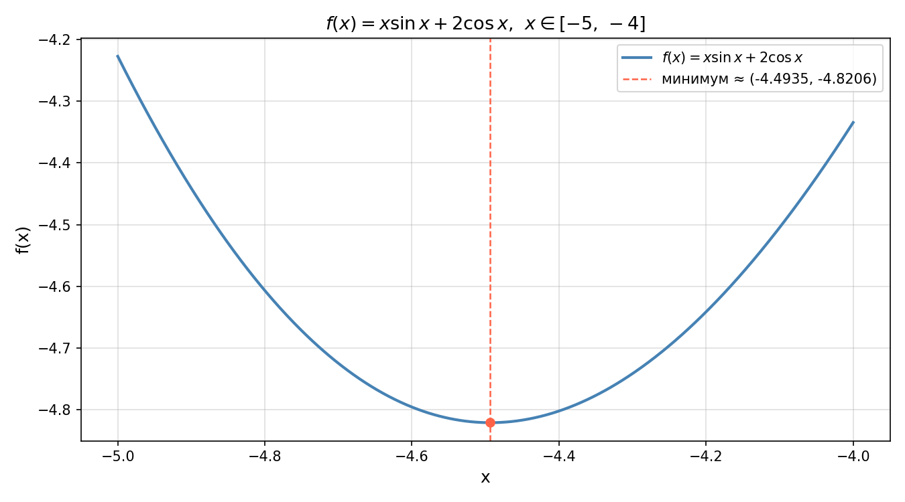

# Отчёт по лабораторной работе №3
# Методы одномерной минимизации

---

## 1. Постановка задачи

Требуется найти минимум функции одной переменной методами **равномерного поиска** и **золотого сечения**, сравнить их по числу обращений к функции, а также сопоставить фактическое число вычислений с теоретически ожидаемым.

**Исследуемая функция:**

$$f(x) = x \sin x + 2 \cos x$$

**Отрезок поиска:** $[a, b] = [-5,\; -4]$

**Требуемые точности:** $\varepsilon \in \{0.1,\; 0.01,\; 0.001\}$

**Что требуется получить:**

- точку минимума $x^*$, для которой длина финального интервала неопределённости не превышает $\varepsilon$ (найденная точка отличается от истинного минимума не более чем на $\varepsilon$);
- значение функции в точке минимума $f(x^*)$;
- фактическое число обращений к функции для каждого метода;
- теоретически ожидаемое число обращений по формуле;
- сравнение эффективности методов и вывод о предпочтительности каждого.

---

## 2. Исследование применимости методов (унимодальность)

Оба метода — равномерный поиск и метод золотого сечения — **применимы только для унимодальных функций**, то есть для функций, имеющих на исследуемом отрезке ровно один локальный минимум. Если функция имеет несколько локальных минимумов, методы не гарантируют нахождение глобального.

### 2.1 Аналитическое исследование

Для проверки унимодальности найдём производную функции $f(x) = x\sin x + 2\cos x$:

$$f'(x) = \sin x + x\cos x - 2\sin x = x\cos x - \sin x$$

Условие минимума: $f'(x^*) = 0$, то есть $x^*\cos x^* = \sin x^*$.

Это трансцендентное уравнение, не имеющее явного аналитического решения.
Для проверки унимодальности необходимо установить, что $f'(x)$ меняет знак на $[-5, -4]$ **ровно один раз** — с минуса на плюс.

### 2.2 Численная проверка унимодальности

Вычислим значения $f'(x) = x\cos x - \sin x$ в нескольких точках отрезка $[-5, -4]$:

| $x$      | $\sin x$  | $\cos x$  | $f'(x) = x\cos x - \sin x$ | Знак |
|----------|-----------|-----------|----------------------------|------|
| $-5{,}0$ | $+0{,}9589$ | $+0{,}2837$ | $(-5)(0{,}2837) - 0{,}9589 = -2{,}377$ | $-$ |
| $-4{,}75$ | $+0{,}9999$ | $+0{,}0376$ | $(-4{,}75)(0{,}0376) - 0{,}9999 = -1{,}178$ | $-$ |
| $-4{,}5$ | $+0{,}9775$ | $-0{,}2108$ | $(-4{,}5)(-0{,}2108) - 0{,}9775 = -0{,}029$ | $-$ |
| $-4{,}493$ | $+0{,}9761$ | $-0{,}2173$ | $(-4{,}493)(-0{,}2173) - 0{,}9761 \approx 0$ | $\approx 0$ |
| $-4{,}4$ | $+0{,}9516$ | $-0{,}3072$ | $(-4{,}4)(-0{,}3072) - 0{,}9516 = +0{,}399$ | $+$ |
| $-4{,}0$ | $+0{,}7568$ | $-0{,}6536$ | $(-4{,}0)(-0{,}6536) - 0{,}7568 = +1{,}857$ | $+$ |

**Вывод из таблицы:** производная $f'(x)$ отрицательна при $x \in [-5;\; -4{,}493)$, обращается в нуль при $x \approx -4{,}493$ и становится положительной при $x \in (-4{,}493;\; -4]$.

Производная меняет знак **ровно один раз** — с отрицательного на положительный, что означает существование **единственного минимума** на отрезке $[-5, -4]$.

**Вывод:** функция $f(x) = x\sin x + 2\cos x$ **унимодальна** на отрезке $[-5, -4]$. Оба метода применимы.

### 2.3 Графическая демонстрация

На графике (файл `images/unimodality.png`, построен скриптом `plot.py`) видно, что на отрезке $[-5, -4]$ функция имеет **ровно один минимум** — при $x^* \approx -4{,}4933$. Функция убывает левее этой точки и возрастает правее, что наглядно подтверждает унимодальность и применимость обоих методов.

---

## 3. Описание алгоритмов

### 3.1 Метод равномерного поиска

Идея: разбить отрезок $[a, b]$ на равные части и вычислить функцию в каждом узле. Точкой минимума считается узел с наименьшим значением $f$.

**Алгоритм:**

1. Задать число частей $N = \left\lceil \dfrac{b - a}{\varepsilon} \right\rceil$.

2. Вычислить шаг сетки: $h = \dfrac{b - a}{N}$.

3. Сформировать узлы: $x_i = a + i \cdot h$, $\quad i = 0, 1, \ldots, N$.

4. Вычислить $f(x_i)$ в каждом узле (всего $N + 1$ обращений).

5. Найти $x^* = x_k$, где $k = \arg\min_i f(x_i)$.

**Вывод формулы числа обращений:**

Чтобы гарантировать точность $\varepsilon$, шаг сетки должен не превышать $\varepsilon$:
$$h = \frac{b - a}{N} \leq \varepsilon \quad \Rightarrow \quad N \geq \frac{b - a}{\varepsilon}$$

Так как $N$ должно быть целым, берём $N = \left\lceil \dfrac{b - a}{\varepsilon} \right\rceil$.
Узлов сетки $N + 1$ (от $x_0 = a$ до $x_N = b$), поэтому:

$$N_{\text{вызовов}} = \left\lceil \frac{b - a}{\varepsilon} \right\rceil + 1$$

**Гарантия точности:** так как шаг сетки $h \leq \varepsilon$, реальный минимум находится не дальше $\varepsilon$ от найденного: $|x^* - x_{\text{найд}}| \leq \varepsilon$.

**Вычислительная сложность:** $O(1/\varepsilon)$ — число обращений растёт линейно при уменьшении $\varepsilon$.

---

### 3.2 Метод золотого сечения

Идея: на каждом шаге отбрасывать ту часть отрезка, в которой минимума точно нет, используя особое соотношение — **золотое сечение** $\varphi = \dfrac{\sqrt{5} - 1}{2} \approx 0{,}6180$.

Его ключевое свойство: одна из двух внутренних точек при следующей итерации **переиспользуется**, поэтому каждая итерация требует только **одного** нового вычисления функции.

**Алгоритм:**

1. Вычислить начальные внутренние точки:

$$x_1 = a + (1 - \varphi)(b - a), \qquad x_2 = a + \varphi(b - a)$$

Вычислить $f_1 = f(x_1)$ и $f_2 = f(x_2)$ — **2 начальных обращения**.

2. Пока $(b - a) > \varepsilon$, выполнять итерацию:

   - Если $f_1 < f_2$: минимум в левой части.
     Положить $b := x_2$, $x_2 := x_1$, $f_2 := f_1$.
     Вычислить новую $x_1 = a + (1-\varphi)(b-a)$, $f_1 = f(x_1)$.

   - Иначе: минимум в правой части.
     Положить $a := x_1$, $x_1 := x_2$, $f_1 := f_2$.
     Вычислить новую $x_2 = a + \varphi(b-a)$, $f_2 = f(x_2)$.

   На каждой итерации — **1 новое обращение** к функции.

3. Вернуть $x^* = \dfrac{a + b}{2}$, вычислить $f^* = f(x^*)$ — **1 финальное обращение**.

**Теоретическое число обращений:**

Условие остановки $(b - a) \leq \varepsilon$ достигается за $n$ итераций, где:

$$n = \left\lceil \frac{\log\left(\frac{b-a}{\varepsilon}\right)}{\log\left(\frac{1}{\varphi}\right)} \right\rceil$$

Итого:

$$N_{\text{вызовов}} = \underbrace{2}_{\text{нач.}} + \underbrace{n}_{\text{итерации}} + \underbrace{1}_{\text{финал}} = \left\lceil \frac{\log\left(\frac{b-a}{\varepsilon}\right)}{\log\left(\frac{1}{\varphi}\right)} \right\rceil + 3$$

> **Примечание.** Стандартная формула из учебников даёт $n + 2$ (без финального вызова), когда $x^*$ определяется как середина конечного интервала без вычисления $f$. В данной реализации после завершения цикла дополнительно вычисляется $f\!\left(\tfrac{a+b}{2}\right)$ для возврата значения функции в точке минимума — отсюда $+1$ и итоговое $n + 3$.

**Вычислительная сложность:** $O(\log(1/\varepsilon))$ — логарифмический рост, значительно эффективнее равномерного поиска.

---

## 4. Результаты решения задачи

### 4.1 Метод равномерного поиска

Отрезок $[-5, -4]$, длина $b - a = 1$.

| $\varepsilon$ | $x^*$ | $f(x^*)$ | Вызовов (факт) | Вызовов (теория) |
|---|---|---|---|---|
| $0{,}1$ | $-4{,}500000$ | $-4{,}820477$ | 11 | 11 |
| $0{,}01$ | $-4{,}490000$ | $-4{,}820547$ | 101 | 101 |
| $0{,}001$ | $-4{,}493000$ | $-4{,}820572$ | 1001 | 1001 |

Фактическое число вызовов точно совпадает с теоретическим. Например, при $\varepsilon = 0{,}1$:
$$N = \left\lceil \frac{1}{0{,}1} \right\rceil + 1 = 10 + 1 = 11$$

### 4.2 Метод золотого сечения

| $\varepsilon$ | $x^*$ | $f(x^*)$ | Вызовов (факт) | Вызовов (теория) |
|---|---|---|---|---|
| $0{,}1$ | $-4{,}482779$ | $-4{,}820325$ | 8 | 8 |
| $0{,}01$ | $-4{,}494382$ | $-4{,}820570$ | 13 | 13 |
| $0{,}001$ | $-4{,}493336$ | $-4{,}820572$ | 18 | 18 |

Фактическое число вызовов также совпадает с теоретическим. Например, при $\varepsilon = 0{,}1$, $b - a = 1$:
$$n = \left\lceil \frac{\ln 10}{\ln(1/0{,}618)} \right\rceil = \left\lceil \frac{2{,}303}{0{,}481} \right\rceil = \lceil 4{,}785 \rceil = 5, \quad N = 5 + 3 = 8$$

### 4.3 Сравнение методов

| $\varepsilon$ | Равном. поиск (вызовов) | Золотое сечение (вызовов) | Разница |
|---|---|---|---|
| $0{,}1$ | 11 | 8 | в 1{,}4 раза |
| $0{,}01$ | 101 | 13 | **в 7{,}8 раза** |
| $0{,}001$ | 1001 | 18 | **в 55{,}6 раза** |

**Вывод:** поведение методов принципиально различается:

- **Равномерный поиск:** $11 \to 101 \to 1001$ — при каждом десятикратном уменьшении $\varepsilon$ число вызовов возрастает **в 10 раз** (линейный рост, $O(1/\varepsilon)$).
- **Золотое сечение:** $8 \to 13 \to 18$ — при каждом десятикратном уменьшении $\varepsilon$ число вызовов увеличивается лишь **на 5** (логарифмический рост, $O(\log(1/\varepsilon))$).

При $\varepsilon = 0{,}001$ метод золотого сечения требует в **55 раз** меньше вычислений при одинаковой гарантированной точности.

---

## 5. Обоснование достоверности полученного результата

Для проверки достоверности найденного минимума применяются **необходимые** и **достаточные** условия оптимальности.

### 5.1 Необходимое условие (равенство производной нулю)

Для дифференцируемой функции в точке минимума $x^*$ необходимо:
$$f'(x^*) = 0$$

Производная функции:
$$f'(x) = x\cos x - \sin x$$

Используем наиболее точный результат, полученный методом золотого сечения при $\varepsilon = 0{,}001$: $x^* = -4{,}493336$.

Вычислим тригонометрические значения. Переводим к эквивалентному углу:
$$-4{,}493336 + 2\pi \approx 1{,}7898 \text{ рад}$$

Угол $1{,}7898$ рад находится в промежутке $(\pi/2;\; \pi)$, поэтому:
$$\sin(-4{,}493336) = \sin(1{,}7898) = \sin(\pi - 1{,}7898) = \sin(1{,}3518) \approx +0{,}9761$$
$$\cos(-4{,}493336) = \cos(1{,}7898) = -\cos(1{,}3518) \approx -0{,}2173$$

Подставляем:
$$f'(-4{,}493336) = (-4{,}493336) \cdot (-0{,}2173) - 0{,}9761 = 0{,}9768 - 0{,}9761 = +0{,}0007 \approx 0$$

Значение $f'(x^*) \approx 0{,}001$ близко к нулю. Отличие от нуля объясняется тем, что $x^* = -4{,}493336$ — **приближённое** значение с точностью $\varepsilon = 0{,}001$. Необходимое условие **выполнено** с точностью, соответствующей требуемой погрешности.

### 5.2 Достаточное условие (знак второй производной)

Для того чтобы точка $x^*$ была минимумом, необходимо $f''(x^*) > 0$.

Вычислим вторую производную:
$$f''(x) = \frac{d}{dx}(x\cos x - \sin x) = \cos x - x\sin x - \cos x = -x\sin x$$

Подставляем $x^* = -4{,}493336$:
$$f''(-4{,}493336) = -(-4{,}493336) \cdot 0{,}9761 = 4{,}493336 \cdot 0{,}9761 \approx +4{,}386$$

Так как $f''(x^*) \approx 4{,}386 > 0$, точка $x^*$ является точкой **локального минимума**. Условие выполнено.

### 5.3 Сравнение результатов двух методов

При $\varepsilon = 0{,}001$ оба метода дали практически одинаковый ответ:

| Метод | $x^*$ | $f(x^*)$ |
|---|---|---|
| Равномерный поиск | $-4{,}493000$ | $-4{,}820572$ |
| Золотое сечение | $-4{,}493336$ | $-4{,}820572$ |
| Разность $|x_1^* - x_2^*|$ | $0{,}000336 < \varepsilon$ | — |

Оба метода сошлись к одному и тому же значению функции $f^* = -4{,}820572$, а расхождение в найденной точке не превышает требуемой точности $\varepsilon = 0{,}001$. Это **взаимная верификация** результата двумя независимыми алгоритмами.

### 5.4 Итоговая проверка

Убедимся, что $f(x^*)$ действительно является минимальным значением, а не максимумом, сравнив со значениями на концах отрезка:

$$f(-5) = (-5)\sin(-5) + 2\cos(-5) = (-5)(0{,}9589) + 2(0{,}2837) = -4{,}794 + 0{,}567 = -4{,}227$$
$$f(-4) = (-4)\sin(-4) + 2\cos(-4) = (-4)(0{,}7568) + 2(-0{,}6536) = -3{,}027 - 1{,}307 = -4{,}334$$
$$f(x^*) \approx -4{,}821$$

Значение $f(x^*) = -4{,}821$ **меньше** значений на обоих концах отрезка. Это подтверждает, что найденная точка является глобальным минимумом на $[-5, -4]$.

---

## 6. Вывод

В ходе лабораторной работы решена задача одномерной минимизации функции $f(x) = x\sin x + 2\cos x$ на отрезке $[-5, -4]$ двумя методами.

**Применимость методов** проверена аналитически и численно: производная $f'(x) = x\cos x - \sin x$ меняет знак с отрицательного на положительный ровно один раз, что свидетельствует об унимодальности функции на данном отрезке.

**Найденный минимум:** $x^* \approx -4{,}4933$, $f^* \approx -4{,}8206$.

**Достоверность подтверждена:**
- необходимое условие: $f'(x^*) \approx 0{,}001 \approx 0$;
- достаточное условие: $f''(x^*) \approx 4{,}386 > 0$;
- совпадение результатов обоих методов при $\varepsilon = 0{,}001$.

**Сравнение эффективности методов:**

| $\varepsilon$ | Равном. поиск | Золотое сечение | Выигрыш |
|---|---|---|---|
| $0{,}1$ | 11 | 8 | ×1{,}4 |
| $0{,}01$ | 101 | 13 | ×7{,}8 |
| $0{,}001$ | 1001 | 18 | **×55{,}6** |

**Когда применять каждый метод:**

- **Равномерный поиск** ($O(1/\varepsilon)$) оправдан при очень грубой точности ($\varepsilon \sim 0{,}1$) или когда вычисление $f$ практически бесплатно. Его главное достоинство — простота реализации и отсутствие требования унимодальности (находит глобальный минимум на сетке). Недостаток: число вычислений растёт линейно, что при $\varepsilon = 0{,}001$ уже требует 1001 вызова.

- **Метод золотого сечения** ($O(\log(1/\varepsilon))$) предпочтителен во всех случаях, когда функция унимодальна и требуется высокая точность. Каждое десятикратное уменьшение $\varepsilon$ добавляет лишь $\approx 5$ новых вызовов. При $\varepsilon = 0{,}001$ — всего 18 вызовов против 1001 у равномерного поиска (выигрыш в **55 раз**). Ограничение: требует унимодальности на отрезке поиска.